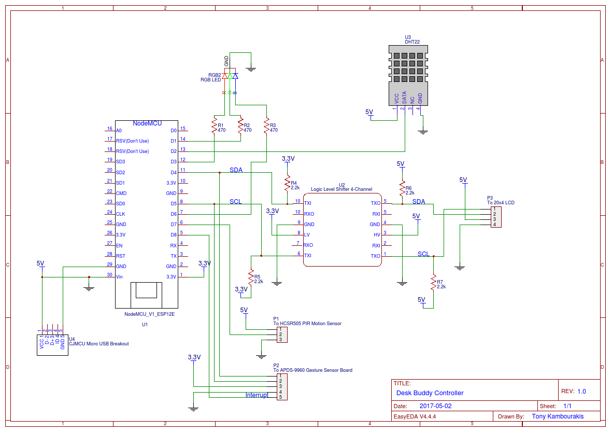

# DeskBuddy Device Controller


##Schematic
The schematic was drawn using EasyEDA ([here](https://easyeda.com/tonykambo/Desk_Buddy_Controller-6655d3a9d81849328680a73bbaf47957)).



##NodeMCU Code
### Add dependency directly to library
The LiquidCrystal I2C library was modified to allow for specifying alternate PINs. 

```
[env:nodemcuv2]
platform = espressif8266
board = nodemcuv2
framework = arduino
lib_deps =
  https://github.com/tonykambo/LiquidCrystal_I2C.git
```
